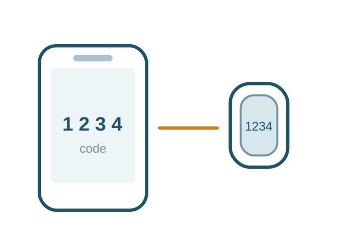

::: {.video-placeholder}
**Video: Setting up your Fitbit (coming soon)**

<!-- When the video is ready, delete the placeholder and use:

-->
:::

## Before you begin — items required

These items are in your pack. Check each one is there. If anything is missing, call us before you start.

::: {.items}

:::

You will also need your own mobile phone, and the Wi-Fi or mobile data you normally use.

## Part 1 · Set up the app and connect your Fitbit

::: {.step}
::: {.num}
1
:::
::: {.text}
### Download the Google Health app

On your phone, open the App Store (iPhone) or the Play Store (Android).

Search for **Google Health** and download it. It is free. The app used to be called Fitbit, so do not worry if you were expecting that name.

::: {.worked}
The app appears on your phone screen with a heart-shaped icon.
:::
:::
::: {.pic}

:::
:::

::: {.step}
::: {.num}
2
:::
::: {.text}
### Charge and turn on the Fitbit

Put the Fitbit on its charger for a few minutes before you start.

To turn it on, squeeze both sides of the tracker at once, or tap the screen firmly twice.

::: {.worked}
The screen lights up.
:::
:::
::: {.pic}

:::
:::

::: {.step}
::: {.num}
3
:::
::: {.text}
### Sign in with the study login

Open the app and sign in using the email address and password printed in your welcome pack.

**Please do not use your own Google or Gmail account.** The study login is what sends your readings to us. If the app signs you in automatically with your own account, sign out first.

::: {.worked}
The email on screen matches the one in your welcome pack.
:::
:::
::: {.pic}

:::
:::

::: {.step}
::: {.num}
4
:::
::: {.text}
### Tap the device icon

In the app, tap the device icon to open the Connections screen.

Under Devices, tap where it offers to connect a Fitbit tracker.

::: {.worked}
You can see the words *Add connections* on the screen.
:::
:::
::: {.pic}

:::
:::

::: {.step}
::: {.num}
5
:::
::: {.text}
### Follow the prompts on screen

The app will guide you through the last few steps. <mark>[DESCRIBE THE REMAINING PROMPTS — e.g. choose your device, allow Bluetooth, wait for the 4-digit code to appear on the tracker and type it in]</mark>

Keep the Fitbit close to your phone until the app says it is connected.

::: {.worked}
The app shows your Fitbit as connected.
:::
:::
::: {.pic}

:::
:::

::: {.callout-important}
Keep the app installed and stay signed in for the whole study. If you sign out or delete the app, we stop receiving your readings.
:::

## Part 2 · Changing the band

Only do this if the band that came fitted is too tight. Otherwise skip to Part 3.

::: {.step}
::: {.num}
6
:::
::: {.text}
### Press the small pin in

Turn the tracker over so you are looking at the back. The band joins the tracker at the top and at the bottom.

At the end of the band nearest the top, there is a small pin set into the band. Press it in with your thumbnail — push it sideways, in towards the centre of the band — and hold it there.
:::
::: {.pic}

:::
:::

::: {.step}
::: {.num}
7
:::
::: {.text}
### Lift that end of the band away

While you hold the pin in, tilt that end of the band away from the tracker and it will come free.

Do the same at the other end.

::: {.worked}
The band comes free of the tracker.
:::
:::
::: {.pic}

:::
:::

::: {.step}
::: {.num}
8
:::
::: {.text}
### Fit the new band

Line the new band up with the end of the tracker, press its pin in towards the centre of the band, slide it into place, and let the pin go.

Give the band a gentle tug to check it is holding.

::: {.worked}
You hear or feel a small click, and the band does not pull off.
:::
:::
::: {.pic}

:::
:::

## Part 3 · Charging the Fitbit

Charge the Fitbit every few days, or whenever the app tells you it is low or you notice the battery is getting low. Charging takes about an hour.

Charge it during the day rather than overnight, so it is on your wrist while you sleep. A good time is while you are in the shower, or while you are sitting down reading or working — put it on the charger, then straight back on your wrist afterwards.

::: {.step}
::: {.num}
9
:::
::: {.text}
### Line up the gold contacts

Turn the tracker over. Across the top of the back there is a row of small gold dots.

Inside the charger there are matching gold pins. Hold the tracker so the two sets of contacts face each other.

::: {.worked}
The gold contacts on the tracker are facing the gold pins in the charger.
:::
:::
::: {.pic}

:::
:::

::: {.step}
::: {.num}
10
:::
::: {.text}
### Clip the tracker into the charger

Press the tracker down into the charger until the small tabs at each end grip it. It should feel firmly held and not fall out if you turn it over.

Plug the other end of the cable into the small power adapter from your pack, then plug the adapter into a wall socket and switch it on.

::: {.worked}
A battery symbol appears on the tracker screen.
:::
:::
::: {.pic}

:::
:::

## If something doesn't look right

| If this happens | Try this |
|---|---|
| The screen will not turn on | Put it on the charger for 10 minutes, then squeeze both sides or tap the screen firmly twice. |
| I cannot find Google Health in the store | Search for the exact words *Google Health*. The publisher is listed as Google. Do not download an app called Fitbit. |
| The app signed me in with my own account | Sign out, then sign back in with the email and password from your welcome pack. |
| The band feels too tight or leaves a mark | Loosen it by one hole. If it is still tight, fit the larger band using Part 2. |
| The app says my Fitbit is not connected | Keep your phone near the tracker, check Bluetooth is switched on, then open the app and wait a minute. |

: {.trouble}


