## Before you begin — items required

These items are in your pack. Check each one is there. If anything is missing, call us before you start.

::: {.items}
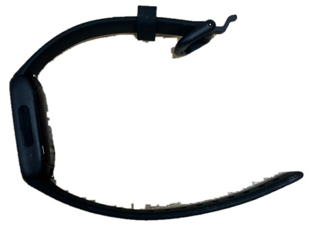

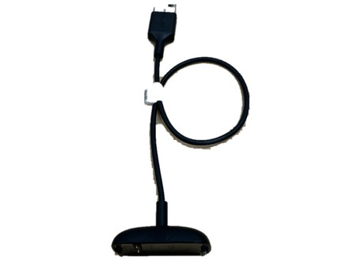


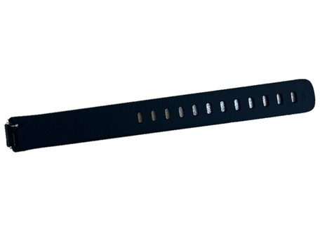
:::

You will also need your own mobile phone, and the Wi-Fi or mobile data you normally use.

::: {.callout-note}
If you already own a Fitbit, you are welcome to wear your own instead of the one we sent. If you do, please tell us the email address that Fitbit is signed in with, so your readings reach us.
:::

## Part 1 · Set up the app and connect your Fitbit

::: {.step}
::: {.num}
1
:::
::: {.text}
### Download the Google Health app

On your phone, open the App Store (iPhone) or the Play Store (Android).

Search for **Google Health** and download it. It is free. The app used to be called Fitbit, so do not worry if you were expecting that name.

::: {.worked}
The app appears on your phone screen with a heart-shaped icon.
:::
:::
::: {.pic}
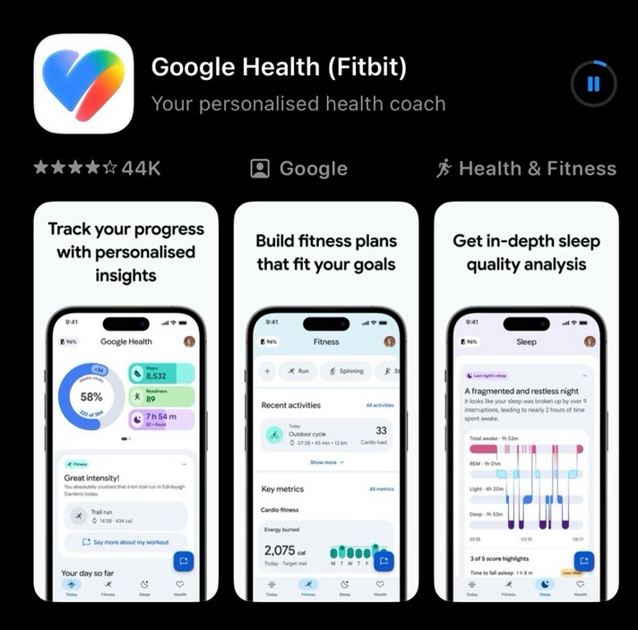
:::
:::

::: {.step}
::: {.num}
2
:::
::: {.text}
### Charge and turn on the Fitbit

Put the Fitbit on its charger for a few minutes before you start.

If you are not sure how to put it on the charger, [Part 3 of this guide](#part-3-charging-the-fitbit) (steps 12 and 13) shows you how.

To turn it on, squeeze both sides of the tracker at once, or tap the screen firmly twice.

::: {.worked}
The screen lights up.
:::
:::
::: {.pic}
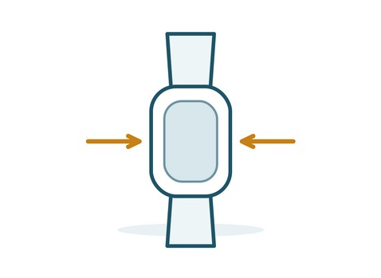
:::
:::

::: {.step}
::: {.num}
3
:::
::: {.text}
### Sign in to the app

Open the app and sign in with a Google account. You can use one you already have, or make a new one.

**Use the same account for the whole study.** The account you sign in with is what sends your readings to us. Keep a note of which one you used — we will ask you for it in Step 8.

::: {.worked}
You are signed in and the app opens on its main screen.
:::
:::
::: {.pic}
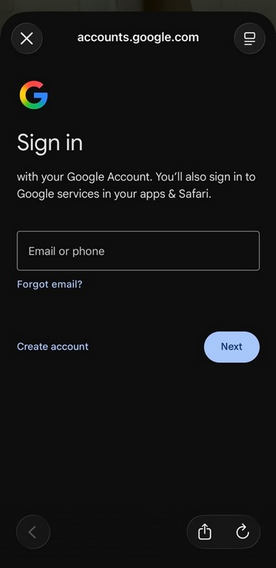
:::
:::

::: {.step}
::: {.num}
4
:::
::: {.text}
### Tap the device icon

In the app, tap the device icon to open the Connections screen.

Under Devices, tap where it offers to connect a Fitbit tracker.

::: {.worked}
You can see the words *Add connections* on the screen.
:::
:::
::: {.pic}
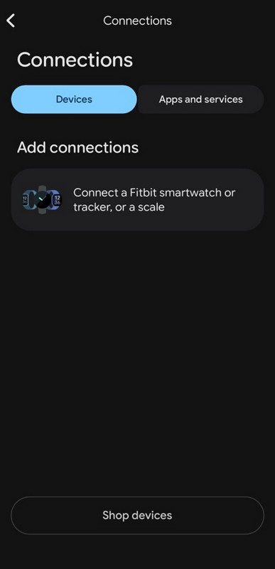
:::
:::

::: {.step}
::: {.num}
5
:::
::: {.text}
### Choose your device

Choose **Inspire 3** from the list of devices. Allow Bluetooth when the app asks. On an Android phone, also allow location and nearby devices.

::: {.worked}
The app starts looking for your tracker.
:::
:::
::: {.pic}
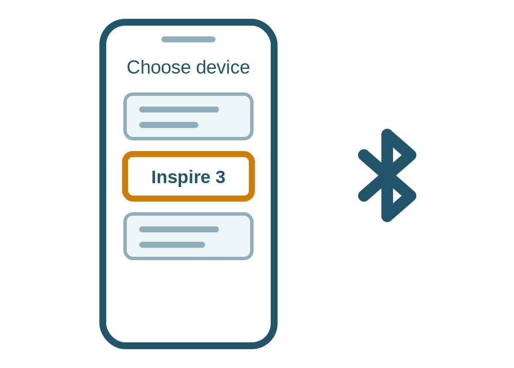
:::
:::

::: {.step}
::: {.num}
6
:::
::: {.text}
### Enter the code from the Fitbit

Leave the Fitbit on its charger and close to your phone while the app looks for it. When a four-digit code appears on the Fitbit screen, type it into the app.

The app may then install an update. This can take a few minutes — keep the Fitbit beside your phone until it finishes.

::: {.worked}
The app accepts the code and moves on.
:::
:::
::: {.pic}
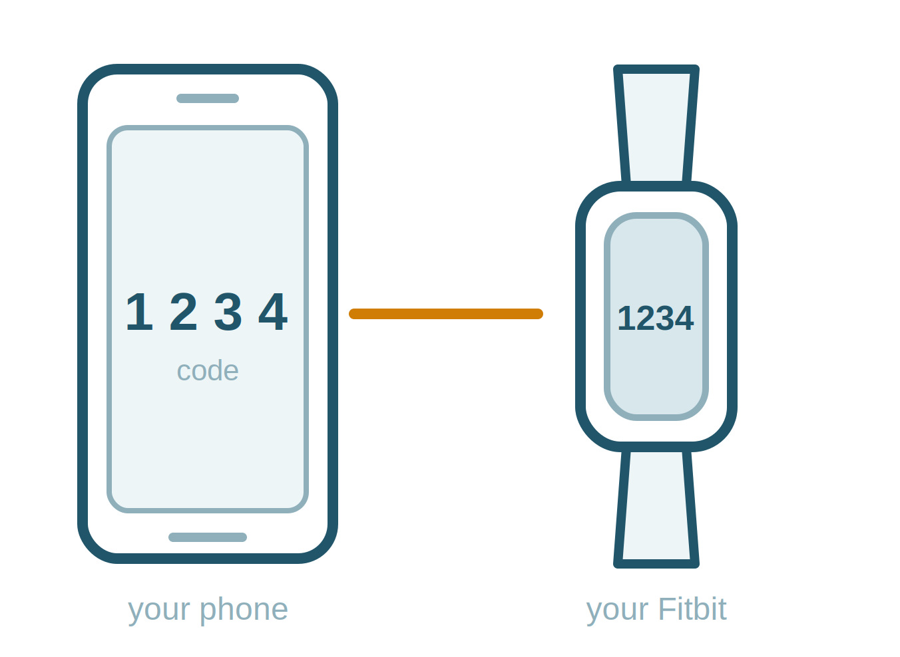
:::
:::

::: {.step}
::: {.num}
7
:::
::: {.text}
### Answer the questions

The app will ask for your height, weight and sex. It uses these to work out distance and calories.

It may also offer to set up goals, notifications and a Premium trial. Fill these in or skip them as you like.

::: {.worked}
The app shows your Fitbit as connected.
:::
:::
::: {.pic}
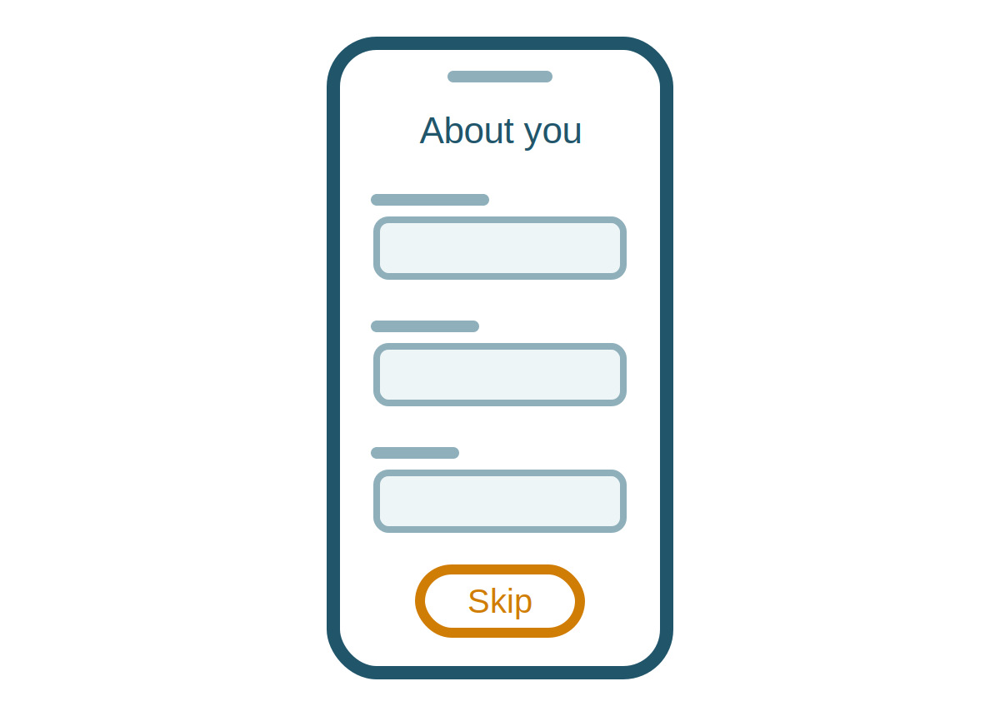
:::
:::

::: {.step}
::: {.num}
8
:::
::: {.text}
### Email us straight away

**Your readings will not reach us until you do this.**

Send us an email with the address of the Google account you signed in with. Please do this as soon as the app says your Fitbit is connected, not later.

```{=html}
<div class="contact-reveal">
<button onclick="revealContact(this)"
  data-e="Zi5vY29ubm9yQGdyaWZmaXRoLmVkdS5hdQ==">Tap to show the email address</button>
<div class="contact-details" hidden></div>
</div>
```

If you have any further questions about setting up the Fitbit, please contact Dr Fergus O'Connor:

```{=html}
<div class="contact-reveal">
<button onclick="revealContact(this)"
  data-n="RHIgRmVyZ3VzIE8nQ29ubm9y"
  data-p="MDQxMiAwMzIgMjY2">Tap to show the phone number</button>
<div class="contact-details" hidden></div>
</div>
```

::: {.worked}
You have sent us the email.
:::
:::
::: {.pic}
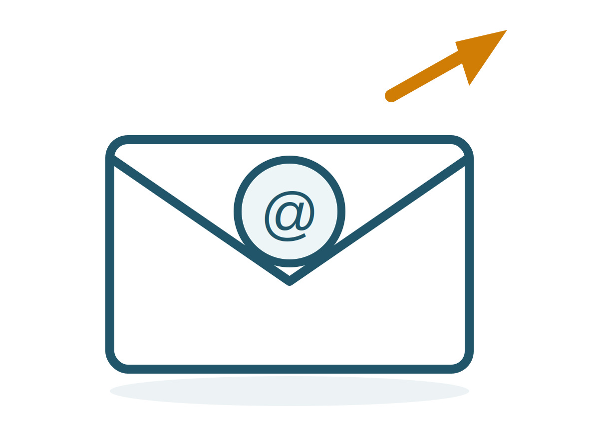
:::
:::

::: {.callout-important}
Keep the app installed and stay signed in for the whole study. If you sign out or delete the app, we stop receiving your readings.
:::

## Part 2 · Changing the band

Only do this if the band that came fitted is too tight. Otherwise skip to Part 3.

**Watch how it is done:**



::: {.step}
::: {.num}
9
:::
::: {.text}
### Press the small pin in

Turn the tracker over so you are looking at the back. The band joins the tracker at the top and at the bottom.

At the end of the band nearest the top, there is a small pin set into the band. Press it in with your thumbnail — push it sideways, in towards the centre of the band — and hold it there.
:::
::: {.pic}
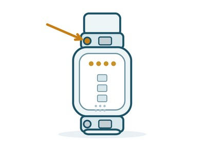
:::
:::

::: {.step}
::: {.num}
10
:::
::: {.text}
### Lift that end of the band away

While you hold the pin in, tilt that end of the band away from the tracker and it will come free.

Do the same at the other end.

::: {.worked}
The band comes free of the tracker.
:::
:::
::: {.pic}
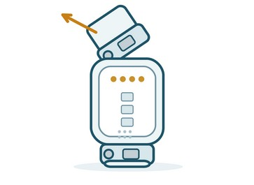
:::
:::

::: {.step}
::: {.num}
11
:::
::: {.text}
### Fit the new band

Line the new band up with the end of the tracker, press its pin in towards the centre of the band, slide it into place, and let the pin go.

Give the band a gentle tug to check it is holding.

::: {.worked}
You hear or feel a small click, and the band does not pull off.
:::
:::
::: {.pic}
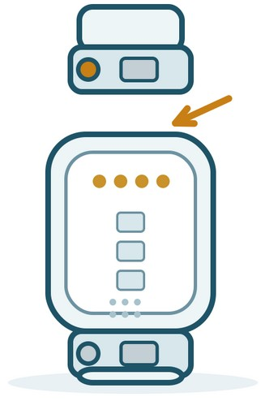
:::
:::

## Part 3 · Charging the Fitbit

Charge the Fitbit every few days, or whenever the app tells you it is low or you notice the battery is getting low. Charging takes about an hour.

Charge it during the day rather than overnight, so it is on your wrist while you sleep. A good time is while you are in the shower, or while you are sitting down reading or working — put it on the charger, then straight back on your wrist afterwards.

**Watch how it is done:**



::: {.step}
::: {.num}
12
:::
::: {.text}
### Line up the gold contacts

Turn the tracker over. Across the top of the back there is a row of small gold dots.

Inside the charger there are matching gold pins. Hold the tracker so the two sets of contacts face each other.

::: {.worked}
The gold contacts on the tracker are facing the gold pins in the charger.
:::
:::
::: {.pic}
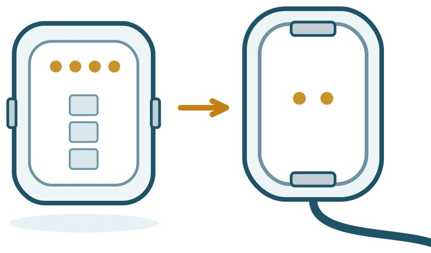
:::
:::

::: {.step}
::: {.num}
13
:::
::: {.text}
### Clip the tracker into the charger

Press the tracker down into the charger until the small tabs at each end grip it. It should feel firmly held and not fall out if you turn it over.

Plug the other end of the cable into the small power adapter from your pack, then plug the adapter into a wall socket and switch it on.

::: {.worked}
A battery symbol appears on the tracker screen.
:::
:::
::: {.pic}
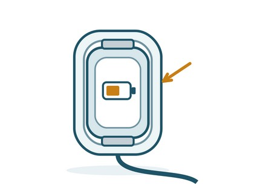
:::
:::

## If something doesn't look right

| If this happens | Try this |
|---|---|
| The screen will not turn on | Put it on the charger for 10 minutes, then squeeze both sides or tap the screen firmly twice. |
| I cannot find Google Health in the store | Search for the exact words *Google Health*. The publisher is listed as Google. Do not download an app called Fitbit. |
| I am not sure which account I used | Open the app and tap your profile to see the email you are signed in with. Tell us if it has changed. |
| The band feels too tight or leaves a mark | Loosen it by one hole. If it is still tight, fit the larger band using Part 2. |
| The app says my Fitbit is not connected | Keep your phone near the tracker, check Bluetooth is switched on, then open the app and wait a minute. |

: {.trouble}


