::: {.callout-note}
Only set up the mattress topper **after the research team has called to tell you it is time**. It arrives separately from the rest of your equipment.
:::

::: {.video-placeholder}
**Video: Setting up the mattress topper (coming soon)**

<!--  -->
:::

## Before you begin — items required

These items are in your pack. Check each one is there. If anything is missing, call us before you start.

::: {.items}
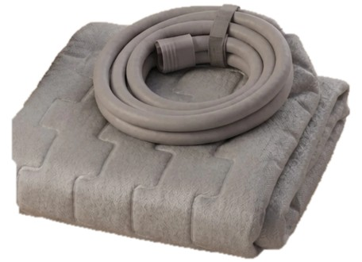

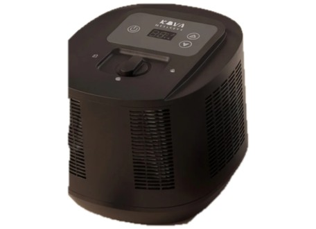

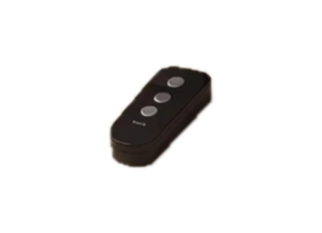
:::

You will also need a jug of water and a power point within reach of the bed.

## Part 1 · Setting up the topper

::: {.step}
::: {.num}
1
:::
::: {.text}
### Put the topper on the bed

Strip the bed down to the bare mattress. Lay the topper on top with the grey side facing up.

Put it close to one side edge of the mattress for now — you will slide it across to the middle at the end of Step 2.

Point the end with the tube towards the head or the foot of the bed, whichever is closer to a power point.

::: {.worked}
The topper lies flat, grey side up, with the tube end at the head or foot.
:::
:::
::: {.pic}
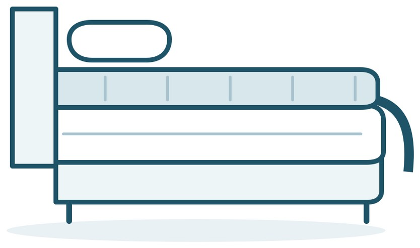
:::
:::

::: {.step}
::: {.num}
2
:::
::: {.text}
### Secure the elastic straps

The topper has two long elastic straps.

At the head of the bed, tuck both straps down between the mattress and its base. Run them along underneath the mattress and bring them out at the foot of the bed.

Now slide the topper across so it sits in the middle of the mattress. This pulls the straps snug.

::: {.worked}
The straps run under the mattress and the topper sits in the middle without sliding.
:::
:::
::: {.pic}
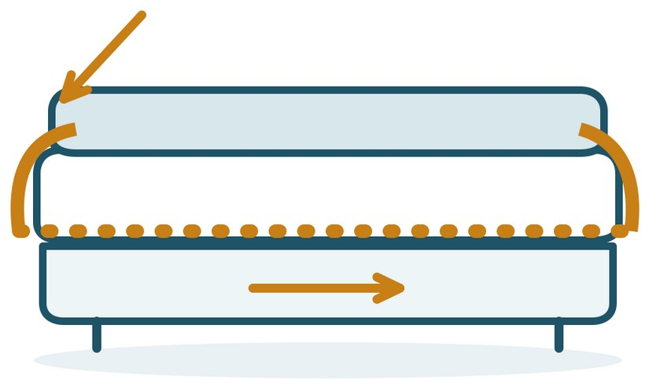
:::
:::

::: {.step}
::: {.num}
3
:::
::: {.text}
### Connect the tube to the control unit

Stand the control unit on the floor beside the bed, at the end you chose in Step 1.

Push the connector tube firmly into the socket on the control unit until it stops.

Make sure the tube runs freely and is not kinked, pinched under a bed leg, or across a walkway.

::: {.worked}
The tube is fully seated and does not pull out with a gentle tug.
:::
:::
::: {.pic}
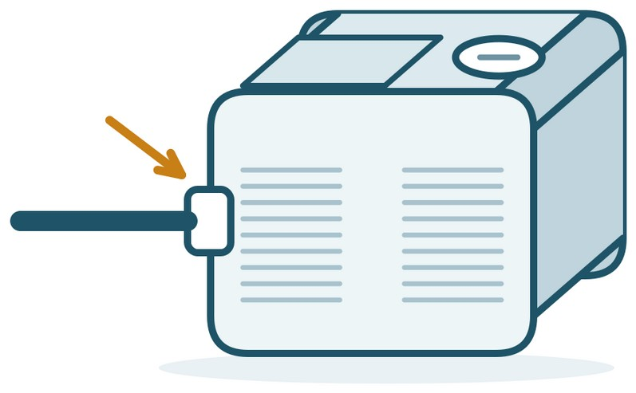
:::
:::

::: {.step}
::: {.num}
4
:::
::: {.text}
### Plug in and switch on

Plug the power cord into the control unit, then into the wall socket, and switch the socket on.

Turn the control unit on to standby.

::: {.worked}
The control unit display lights up.
:::
:::
::: {.pic}
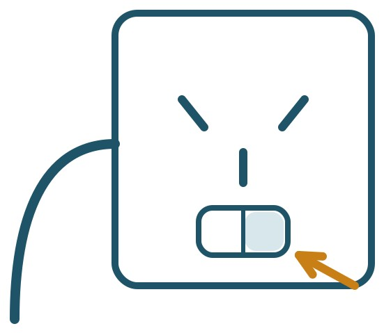
:::
:::

::: {.step}
::: {.num}
5
:::
::: {.text}
### Fill with water

Take the cap off the water tank on the top of the control unit and pour water in until it is close to the top, leaving a small gap below the opening.

The topper will draw water in, so the level will drop. Wait a moment, then top it back up. Repeat until the level stops falling.

Screw the cap back on firmly.

::: {.worked}
The water level holds steady close to the top and the cap is back on.
:::
:::
::: {.pic}
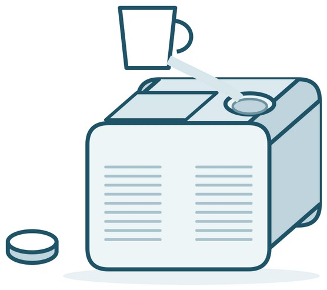
:::
:::

::: {.step}
::: {.num}
6
:::
::: {.text}
### Set the temperature

Use the two arrow buttons on the top of the control unit to set the temperature. The up arrow makes the bed warmer, the down arrow makes it cooler.

We suggest starting somewhere between 16 and 20 degrees, but set it to whatever feels comfortable to you.

Then make the bed as usual: waterproof protector over the topper, then your sheet on top.

::: {.worked}
The display shows the temperature you set.
:::
:::
::: {.pic}
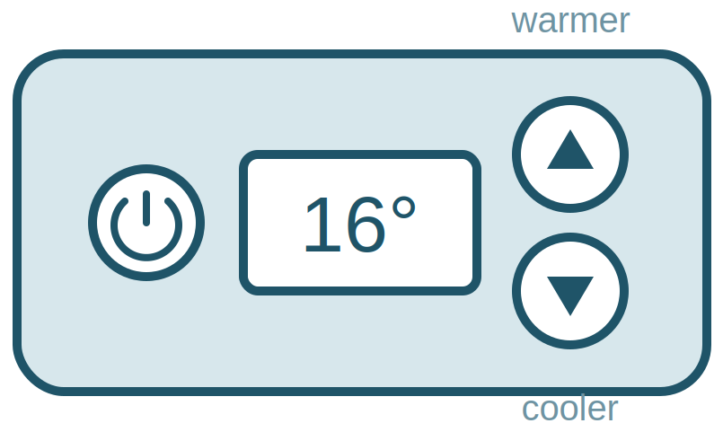
:::
:::

::: {.callout-important}
Do not fold, sit on, or place heavy objects on the topper, and keep the tube clear of bed legs and castors. Fluid runs through it, and a kink or crush stops the topper working.
:::

## Part 2 · Topping up the water

The topper uses a little water over time, so the level in the tank slowly drops. The control unit tells you when it needs topping up.

::: {.step}
::: {.num}
7
:::
::: {.text}
### Check the water level

You do not need to keep an eye on this. The control unit will let you know when the water is getting low — it beeps and shows a warning on the display.

When that happens, take the cap off the tank and look inside to see how far the water has dropped.

::: {.worked}
You can see how far down the water sits.
:::
:::
::: {.pic}
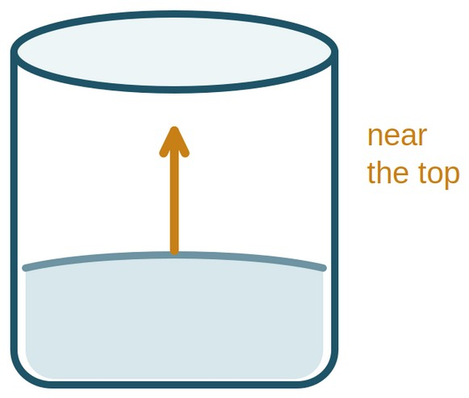
:::
:::

::: {.step}
::: {.num}
8
:::
::: {.text}
### Top it up

Pour water in until it is close to the top again, leaving a small gap below the opening. The warning will clear once there is enough water.

Screw the cap back on firmly. You do not need to turn the unit off to do this.

::: {.worked}
The water is back up close to the top and the cap is back on.
:::
:::
::: {.pic}
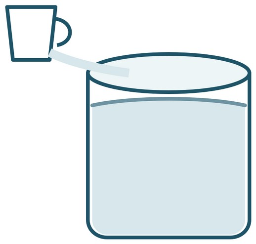
:::
:::

::: {.callout-tip title="While the study is running"}
Sleep on the topper every night, and leave the control unit plugged in and switched on for the whole study.

The topper is there to cool you, much like an air conditioner would. Set it to a level that keeps you cool, and adjust it whenever you like.
:::

## If something doesn't look right

| If this happens | Try this |
|---|---|
| The topper does not feel cool | Check the water is close to the top of the tank, and check the tube is not kinked or trapped under a bed leg. |
| The control unit is beeping or showing a warning | Top the water up close to the top of the tank. If the warning stays on, call us. |
| There is water on the floor or the bed feels damp | Switch the wall socket off, put a towel down, and call us straight away. Do not keep using it. |
| The topper has slid out of place | Pull the bed away from the wall, re-hook the elastic straps at each corner, and pull them snug. |
| The control unit is noisy | A soft hum is normal. If it rattles, gurgles loudly, or keeps you awake, call us. |

: {.trouble}


