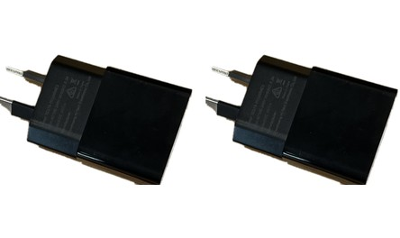
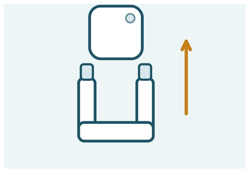
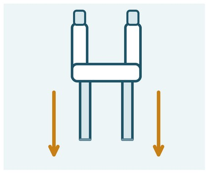
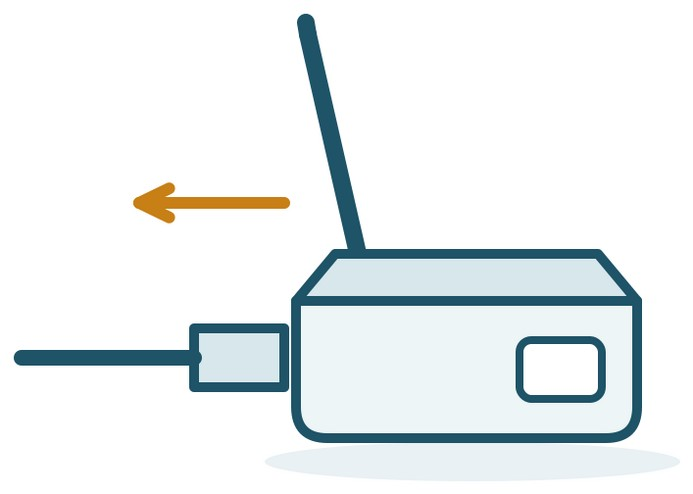
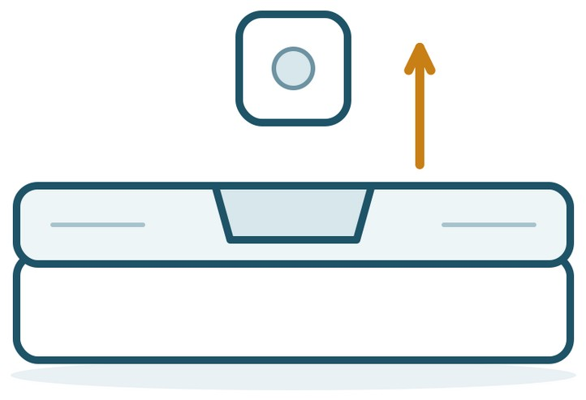
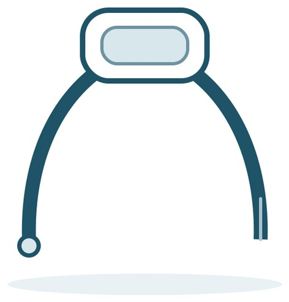
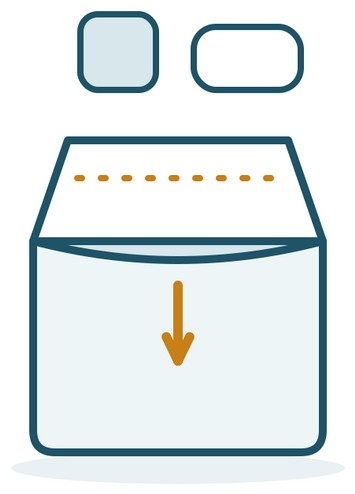
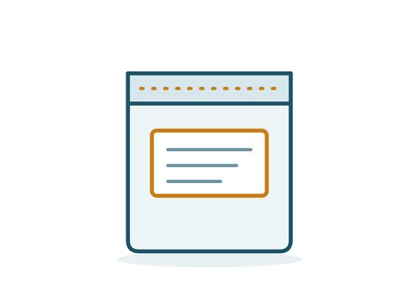
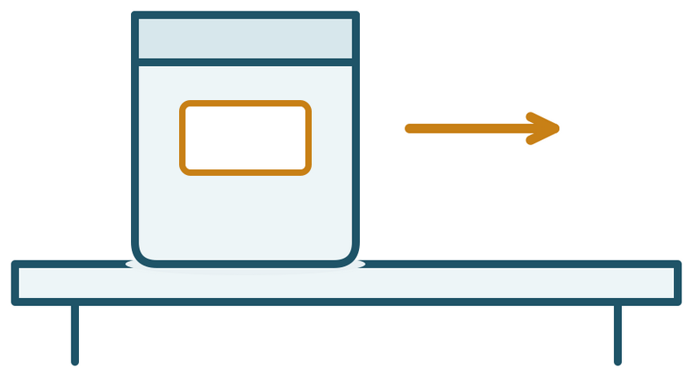

We will be in touch to arrange the return with you — you do not need to work out the timing on your own.

## Items to return

Every item below goes back. If anything is missing or broken, post the rest anyway and tell us — you will not be charged for it.

::: {.items}

:::

::: {.callout-tip title="Yours to keep"}
**The mattress topper and its control unit are yours to keep.** They do not go back in the bag.
:::

## Part 1 · Getting the equipment ready

::: {.step}
::: {.num}
1
:::
::: {.text}
### Take the sensor and holder off the wall

Hold the white holder steady and slide the sensor straight up and out of it.

Underneath the holder there are two small pull tabs. Pull each one slowly straight down the wall — down, not out towards you. The strip will stretch and then let go, and the holder will come away cleanly.

Take it slowly and let the strip stretch — that is what releases it. Keep pulling downwards the whole way, rather than away from the wall.

::: {.worked}
The sensor, the holder and both strips are off the wall.
:::
:::
::: {.pic}

:::
:::

::: {.step}
::: {.num}
2
:::
::: {.text}
### Unplug the base station

Switch the wall socket off first, then unplug the power adapter.

Unplug the network cable from the back of your router and from the base station, and unplug the base station's charging cable from the adapter. Leave any of your own cables exactly where they are.

::: {.worked}
Your router is left with only its own cables plugged in.
:::
:::
::: {.pic}

:::
:::

::: {.step}
::: {.num}
3
:::
::: {.text}
### Take the gauge out of the mattress pod

The small temperature gauge was already fitted when the pod arrived. It sits in the filling area.

Lift it out and set it aside. Nothing needs to be unplugged or switched off.

::: {.worked}
The gauge is out of the pod and undamaged.
:::
:::
::: {.pic}

:::
:::

::: {.step}
::: {.num}
4
:::
::: {.text}
### Take off the Fitbit and gather the rest

Take the Fitbit off your wrist.

Open the Google Health app on your phone one last time, with the tracker still beside you, and leave it open for a minute. This lets your last few days of readings reach us.

Then sign out of the study account in the app. Once you are signed out you can delete the app from your phone if you like.

Collect the charging cable and the band extender.

::: {.worked}
You are signed out of the app and everything on the list is together in one place.
:::
:::
::: {.pic}

:::
:::

## Part 2 · Posting it back

A sealable postage bag came with the equipment we sent you. The return address is already printed on it, so there is nothing to write and nothing to pay.

::: {.step}
::: {.num}
5
:::
::: {.text}
### Put everything in the bag

Put all the items from the list into the postage bag.

::: {.worked}
Everything on the list is inside the bag.
:::
:::
::: {.pic}

:::
:::

::: {.step}
::: {.num}
6
:::
::: {.text}
### Seal the bag

Peel the strip off the sticky edge of the bag, fold the flap over, and press it down firmly along its whole length.

Check the return address label is still stuck on and easy to read. Do not write anything else on the bag.

::: {.worked}
The bag is sealed shut and the address label is clearly visible.
:::
:::
::: {.pic}

:::
:::

::: {.step}
::: {.num}
7
:::
::: {.text}
### Take it to any post office

Hand the bag over at the counter of any Australia Post office. Postage is already paid, so there is nothing to buy.

Please post it within one to two weeks of the study finishing. We will contact you at the end of the study to arrange all of this with you.

::: {.worked}
The bag has been handed over at the counter.
:::
:::
::: {.pic}

:::
:::

## If something doesn't look right

| If this happens | Try this |
|---|---|
| I cannot find the postage bag | Call us and we will post you another one. Please do not pay for your own postage. |
| Something is missing or broken | Post the rest of the equipment anyway and let us know what is missing. You will not be charged. |
| A strip snapped before it released | Take hold of what is left of the tab and keep pulling slowly straight down the wall. If there is no tab left to grip, work a fingernail behind the holder and pull it down, not out. |
| I cannot get to a post office | Call us — we can arrange to collect the equipment from you instead. |

: {.trouble}


