::: {.video-placeholder}
**Video: Setting up the temperature sensor (coming soon)**

<!--  -->
:::

## Before you begin — items required

These items are in your pack. Check each one is there. If anything is missing, call us before you start.

::: {.items}
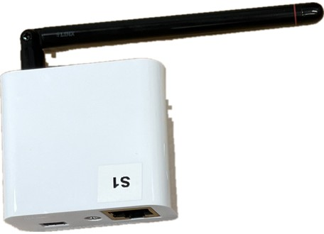

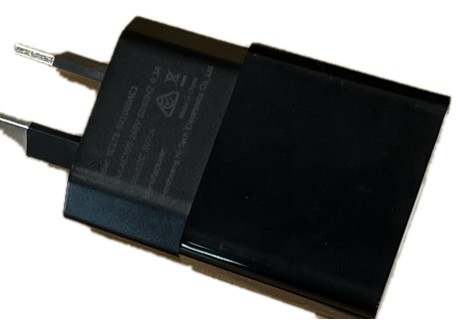

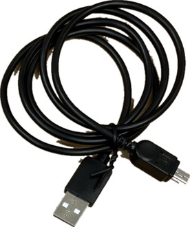

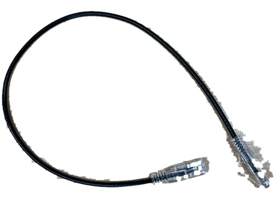

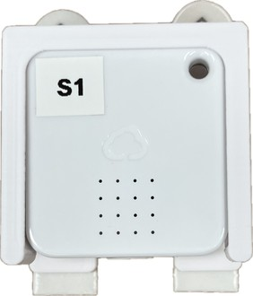

:::

You will also need a power point near your internet router, and a clear patch of wall in your bedroom.

## Part 1 · Connect the base station to your internet

::: {.step}
::: {.num}
1
:::
::: {.text}
### Find your internet router

This is the box your internet provider gave you — the one that gives you Wi-Fi.

It is usually in the hallway, lounge room or study, near the phone socket. It often has one or more aerials and a row of small green lights.

::: {.worked}
You can see a row of small square sockets on the back.
:::
:::
::: {.pic}
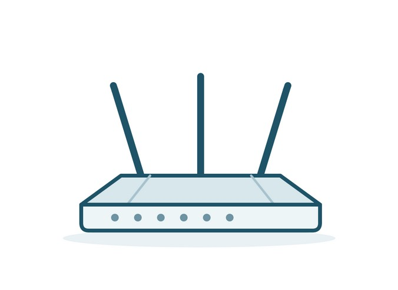
:::
:::

::: {.step}
::: {.num}
2
:::
::: {.text}
### Plug the cable into the router

Take the network cable from your pack. Plug one end into the socket on the back of the base station.

Plug the other end into a spare socket on the back of your router. The right sockets are labelled **LAN** and are often coloured yellow.

Do not use the socket labelled **WAN** or **DSL**. Leave any cables that are already plugged in exactly where they are.

::: {.worked}
Both ends click into place and do not pull out easily.
:::
:::
::: {.pic}
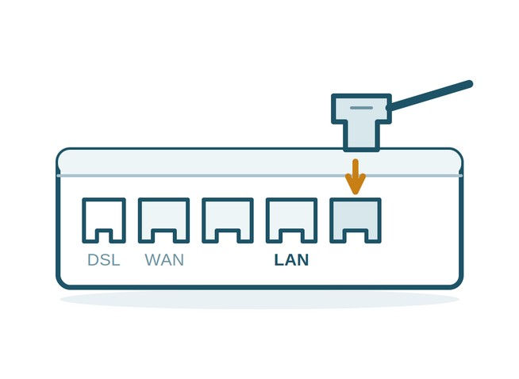
:::
:::

::: {.step}
::: {.num}
3
:::
::: {.text}
### Turn the base station on

Plug the base station's power adapter into a wall socket.

Switch the socket on at the wall. On the front of the base station there is a row of small symbols. The exclamation mark on the left will light up red. This just means it has power — it has not found your internet yet.

::: {.worked}
The exclamation mark on the left is lit red.
:::
:::
::: {.pic}
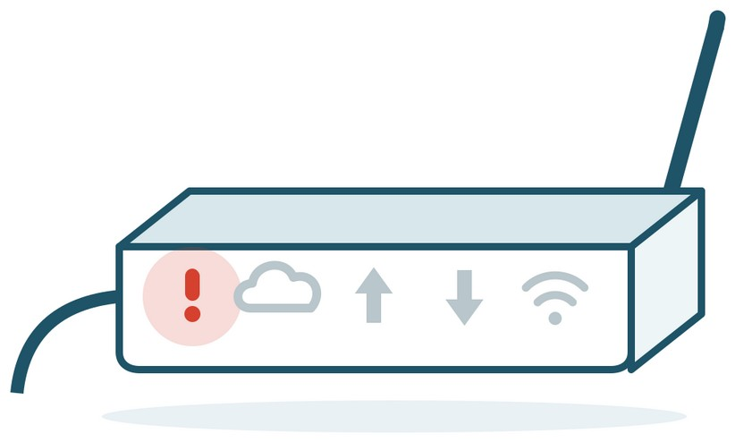
:::
:::

::: {.step}
::: {.num}
4
:::
::: {.text}
### Wait one minute

The red exclamation mark will go out and the cloud symbol next to it will light up green. Green means the base station has found your internet and is working.

Once the cloud is green, you are finished with Part 1. Leave the base station plugged in and switched on for the whole study.

::: {.worked}
The cloud symbol is lit green.
:::
:::
::: {.pic}
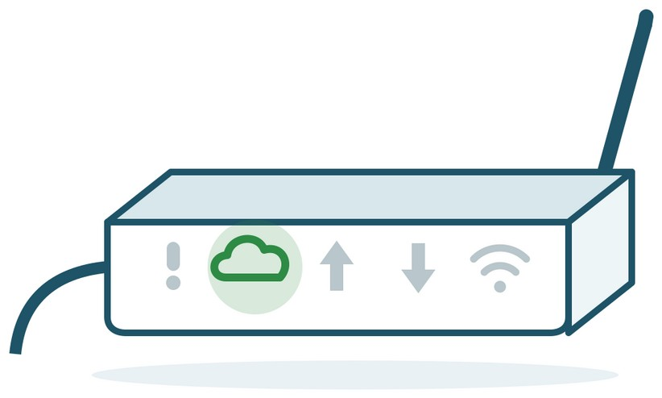
:::
:::

::: {.callout-important}
Do not unplug the base station or switch the socket off overnight. If it is unplugged, we stop receiving your readings.
:::

## Part 2 · Put the sensor on your bedroom wall

::: {.step}
::: {.num}
5
:::
::: {.text}
### Choose the right spot

The sensor comes clipped into a white holder, and it is the holder that sticks to the wall. Pick a clear patch of wall in the room where you sleep, close to your bed.

Choose a spot that is out of direct sunlight, and away from windows, fans, heaters and air-conditioning vents.

Avoid putting it behind curtains, inside a wardrobe, or directly above a lamp. Anything warm or draughty nearby will give us the wrong reading.

::: {.worked}
The spot stays shaded all day and nothing blows air across it.
:::
:::
::: {.pic}
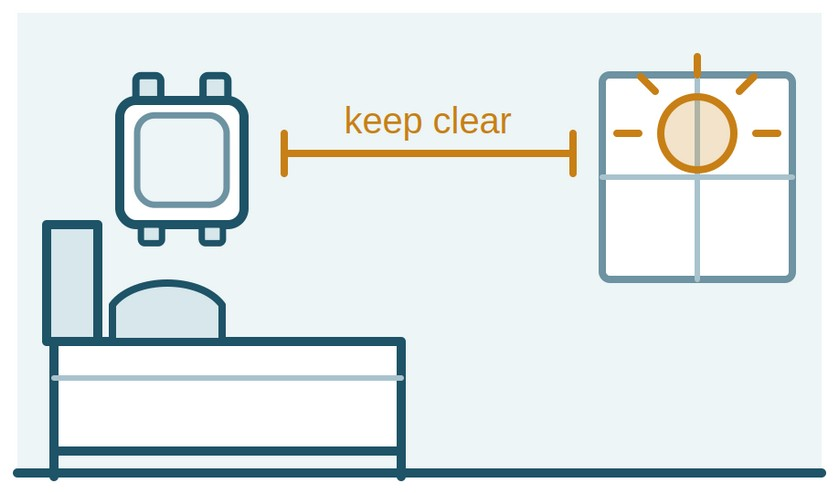
:::
:::

::: {.step}
::: {.num}
6
:::
::: {.text}
### Peel off the paper backing

The sensor sits in a white holder. Turn the holder over — near the top there are two sticky strips, each covered with a paper backing.

Peel the paper off both strips. Try not to touch the sticky surfaces with your fingers — they hold better if you don't.
:::
::: {.pic}
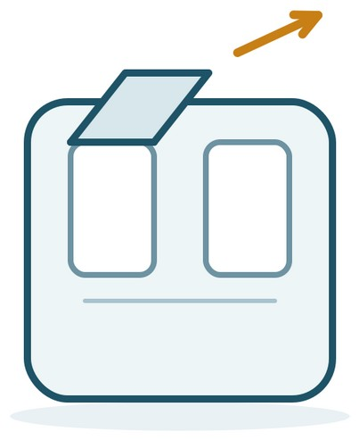
:::
:::

::: {.step}
::: {.num}
7
:::
::: {.text}
### Press it onto the wall

Press the holder firmly onto the wall so both sticky strips make full contact, and hold it there for about 30 seconds.

Then leave it alone for an hour before touching it again, so the adhesive can set. The sensor can stay clipped in the holder the whole time.

::: {.worked}
The holder stays put when you gently let go.
:::
:::
::: {.pic}
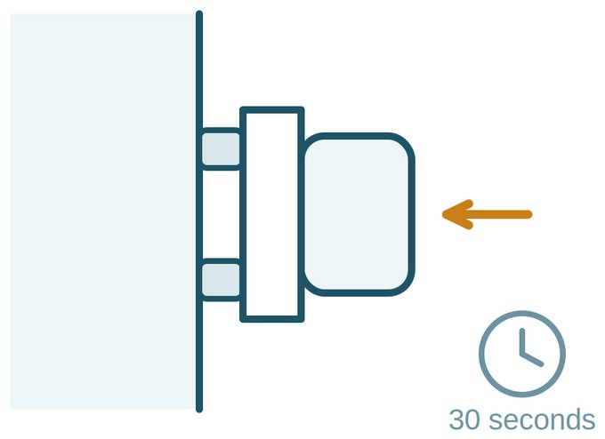
:::
:::

::: {.callout-note title="Good to know"}
The strips are paint-safe and will not mark your wall. If the holder does not stick, or comes away later, call us and we will send you new strips.
:::

## Part 3 · Changing the battery

You do not need to check the battery yourself. We can see how much charge is left from our end, and if it starts running low we will call you and let you know it needs changing. **Nothing here is needed during set-up.**

::: {.step}
::: {.num}
8
:::
::: {.text}
### Take the sensor out of its holder

Leave the white holder stuck on the wall — it stays there.

Hold the holder steady with one hand and slide the sensor straight up and out of it with the other.

::: {.worked}
The sensor is in your hand and the holder is still on the wall.
:::
:::
::: {.pic}
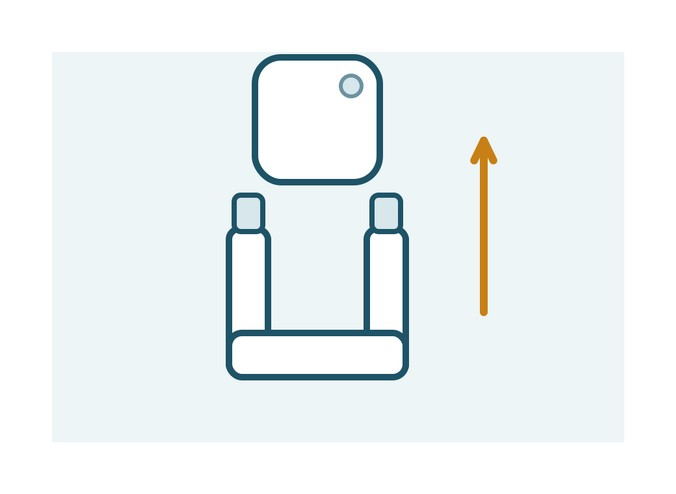
:::
:::

::: {.step}
::: {.num}
9
:::
::: {.text}
### Open the sensor

You will need something thin and flat, such as a butter knife or a small flat screwdriver.

There is a small gap in the top edge of the sensor, made for exactly this. Slide the flat edge into that gap and twist gently, then work around the edge until the outer cover comes away.

Underneath there is a second white cover. Lift this one off as well, and you will see the circuit board with the battery on it.

::: {.worked}
Both covers are off and you can see the round silver battery.
:::
:::
::: {.pic}
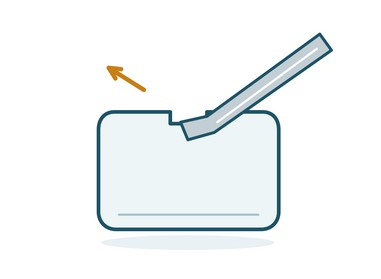

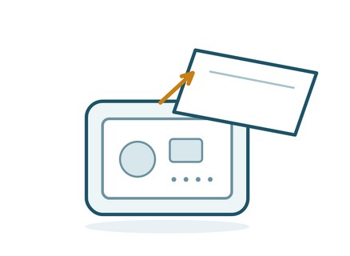
:::
:::

::: {.step}
::: {.num}
10
:::
::: {.text}
### Swap the battery

The round silver battery sits in a socket, held in place by two small metal clips.

Do not try to prise it upwards. Rest the flat edge of your tool against the side of the battery and give it a gentle push sideways — it will slide smoothly out from under the clips.

Slide the new battery in the same way, the same way up, with the writing facing you, until it sits under both clips. You should hear a short beep.

::: {.worked}
The new battery sits flat under both clips and you heard a beep.
:::
:::
::: {.pic}
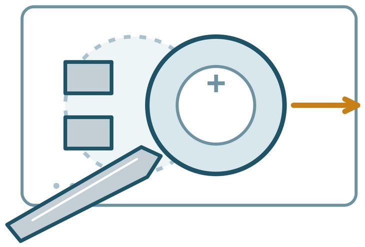
:::
:::

::: {.step}
::: {.num}
11
:::
::: {.text}
### Close it and put it back

Line the two halves up and press them together all the way round until they click shut.

Slide the sensor back down into the holder on the wall. Nothing needs to be stuck back on.

You can throw the old battery away yourself — many supermarkets and hardware shops have a battery recycling bin. Until then, keep it well out of reach of children and pets.

::: {.worked}
The sensor is back in its holder on the wall.
:::
:::
::: {.pic}
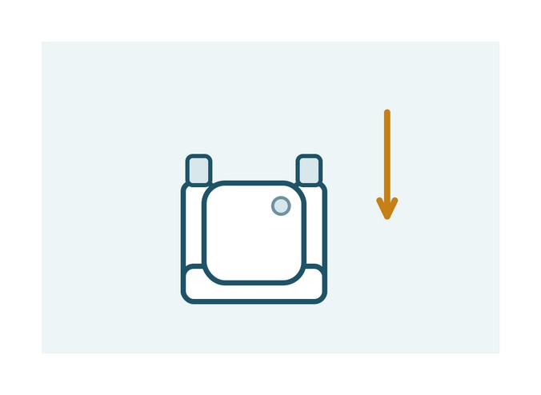
:::
:::

## If something doesn't look right

| If this happens | Try this |
|---|---|
| The exclamation mark is still red after 5 minutes | Check both ends of the network cable are pushed all the way in. Unplug the base station at the wall, wait 10 seconds, and plug it back in. |
| There is no spare socket on the back of my router | Please do not unplug anything. Call us and we will arrange an alternative. |
| No symbols light up at all | Check the wall socket is switched on, and try a different wall socket. |
| The holder has come off the wall | Keep the sensor and holder safe and call us. We will send you new sticky strips. |
| I did not hear a beep when I changed the battery | Take the battery out, turn it over, and check the flat side faces the same way as before. If there is still no beep, call us. |

: {.trouble}


